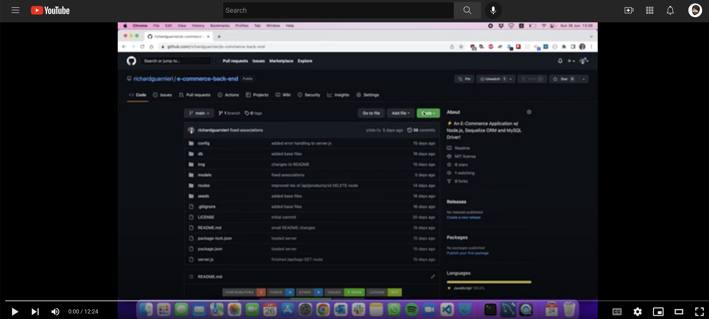

<!-- This template was created following The Markdown Guide - https://www.markdownguide.org/ -->

<!-- If you are editing this README.md on VS Code, please highlight and replace the following keywords enclosed in backticks (``) using:
* MacOS: CMD + Shift + L
* Windows: CRTL + Shift + L

GitHub Username: `richardguarnieri`
GitHub Repository: `social-network-api`
Your Name: `Richard Guarnieri`
Email: `richard.gm@outlook.com`
LinkedIn Username: `rguarnieri`
Twitter Username: `ric_guarnieri`
Project Title: `Social Network API`
Project Description: `A Social Network API built w/ Node.js, Express.js, and Mongoose ODM!`
-->

<!-- Please also update the following links -->
[logo]: ./img/logo.png
[application-image]: ./img/app-image.png

<div id="home"><div> 

<!-- Badges / Shields -->
<!-- These were created using https://shields.io/ - feel free to replace / create yours by modifying links below: -->

<div align="center">
    <a href="https://github.com/richardguarnieri/social-network-api/graphs/contributors">
        
    <a>
     <a href="https://github.com/richardguarnieri/social-network-api/network/members">
        
    <a>
     <a href="https://github.com/richardguarnieri/social-network-api/stargazers">
        
    <a>
     <a href="https://github.com/richardguarnieri/social-network-api/issues">
        
    <a>
     <a href="https://github.com/richardguarnieri/social-network-api/blob/main/LICENSE">
        
    <a>
     <a href="https://github.com/richardguarnieri/social-network-api/commits/main">
        
    <a>
    <a href="https://www.linkedin.com/in/rguarnieri/">
        
    <a>
</div>
<br>


<!-- Header -->

<div align="center">
    <a href="https://github.com/richardguarnieri/social-network-api">
        
    </a>
    <h1 align="center">Social Network API</h1>
    <div>
        A Social Network API built w/ Node.js, Express.js, and Mongoose ODM!
        <br>
        <a href="https://github.com/richardguarnieri/social-network-api">
            <strong>Explore Documentation</strong>
        </a>
        <br>
        <br>
        <a href="https://github.com/richardguarnieri/social-network-api">View Demo</a>
        ·
        <a href="https://github.com/richardguarnieri/social-network-api/issues">Report Bug / Request Feature</a>
    </div>
</div>
<br>


<!-- Table of Contents -->
## Table of Contents
* [The Project](#the-project)
    * [Technology Stack](#technology-stack)
* [Getting Started](#getting-started)
    * [Prerequisites](#prerequisites)
    * [Installation](#installation)
* [How to Use](#how-to-use)
* [Contributing](#contributing)
* [License](#license)
* [Contact](#contact)
* [Miscellaneous](#miscellaneous)
    * [User Story](#user-story)
    * [Acceptance Criteria](#acceptance-criteria)
<br>


<!-- The Project -->
## The Project

![Application Image][application-image]

TBA...


<p align="right"> - <a href="#home">Return to Home</a></p>

### Technology Stack
* [JavaScript](https://www.ecma-international.org/publications-and-standards/standards/ecma-262/)
* [Node.js](https://nodejs.org/en/)
* [Express.js](https://expressjs.com/)
* [Mongoose](https://mongoosejs.com/)

<p align="right"> - <a href="#home">Return to Home</a></p>


<!-- Getting Started -->
## Getting Started
To get started you will need a couple of things - clear explanation of this below:

<p align="right"> - <a href="#home">Return to Home</a></p>

### Prerequisites
[Node.js](https://nodejs.org/en/) as we will need it to install [Express.js](https://expressjs.com/) and [Mongoose](https://mongoosejs.com/) packages to run the application.

We also need to install **MongoDB** - links are provided in the next section.

<p align="right"> - <a href="#home">Return to Home</a></p>

### Installation
In order to get started, we must first install [Node.js](https://nodejs.org/en/) - on macOS I prefer to install it using the Homebrew package manager and on Windows using the Node.js homepage download section.

**On macOS:**
1. To install Homebrew on macOS, browse to [Homebrew's official website](https://brew.sh/) and copy the link displayed on the page on the macOS terminal. At the time of writing, this is the command: 
```shell
/bin/bash -c "$(curl -fsSL https://raw.githubusercontent.com/Homebrew/install/HEAD/install.sh)"
```

2. Once Homebrew installation is complete, type the following command to install Node.js and NPM:
```shell
brew install node
```

3. Once the installation finishes, confirm that you successfully installed Node.js by checking its version:
```shell
node -v
```

**On Windows:**
1. In a web browser, navigate to https://nodejs.org/en/download/. Click the Windows Installer button to download the latest default version. At the time of writing, the latest LTS version is 16.15.0.

2. Execute the installer to install Node.js

3. Once the installation finishes, confirm that you successfully installed Node.js by checking its version:
```shell
node -v
```

**MongoDB**

After installing Node.js, we then proceed to install MongoDB. To do so, please review the following documentation:

Linux / macOS / Windows: https://www.mongodb.com/docs/manual/administration/install-community/

Preferably, you would also install the MongoDB Compass visual tool. To do so, follow this link:
https://www.mongodb.com/products/compass

Please ensure **MongoDB** is installed correctly! This is a requirement to run the RESTful API as we will be in constant communication with the database performing CRUD operations.

<p align="right"> - <a href="#home">Return to Home</a></p>


<!-- How to Use -->
## How to Use
First, clone this repo via HTTPS in your local computer - feel free to use any storage destination / folder of your choosing. On macOS / Windows, open the CLI (Command Line Interface) and type the following command (ensure you are located in the exact directory where you want to clone the repo):

```shell
git clone https://github.com/richardguarnieri/social-network-api.git
```
After the repo has sucessfully cloned, navigate to the repo using the cd (chage directory) command:

```shell
cd social-network-api/
```
Once inside the social-network-api directory, install the necessary node pacakges to run the application - in order to do so, pls type on the CLI the following command:

```shell
npm install
```

Above command will install [Express.js](https://expressjs.com/) and [Mongoose](https://mongoosejs.com/) packages along all its dependencies in a newly generated folder within the social-network-api directory called node_modules/

By this point, please ensure you have installed MongoDB and have access to the URI **localhost:27017**. Please make sure you either have no password on your MongoDB instance. If you do, you have to update the **connectionStringURI** variable in **/config/connection.js** to include the password.

After MongoDB is up and running, we are now clear to run the application. To do so, run the index.js file by typing in the CLI the following command:

```shell
npm start
```

After execution, the app will create a Mongoose connection and an Express.js web server. You will have the following API routes available in your http://localhost:3001/:

```shell
GET Methods:
localhost:3001/api/users // find all users
localhost:3001/api/users/:userId // find one user by its id
localhost:3001/api/thoughts // find all thoughts
localhost:3001/api/thoughts/:thoughtId // find one thought by its id

POST Methods:
localhost:3001/api/users // create a new user
localhost:3001/api/users/:userId/friends/:friendId // assign a friendId to an existing user
localhost:3001/api/thoughts // create a new thought
localhost:3001/api/thoughts/:thoughtId/reactions // create a new reaction and assign it to an existing thought

PUT Methods:
localhost:3001/api/users/:userId // update a user by its id value
localhost:3001/api/thoughts/:thoughtId // update a thought by its id value

DELETE Methods:
localhost:3001/api/users/:userId // delete a user by its id value
localhost:3001/api/users/:userId/friends/:friendId // delete a friendId on an existing userId
localhost:3001/api/thoughts/:thoughtId // delete a thought by its id value
localhost:3001/api/thoughts/:thoughtId/reactions/:reactionId // delete a reaction from an existing thought
```

The following video walkthrough explains how to use the app and each of its routes:

[](https://github.com/richardguarnieri/social-network-api)

_For more examples, please refer to the [Documentation][documentation-url]._

<p align="right"> - <a href="#home">Return to Home</a></p>


<!-- Contribuiting -->
## Contributing
Contributions are much welcomed! If you have suggestions to make this application better, please fork the repo and create a pull request. 

You can also open an issue [here][github-issues-url] and tag it with the **"enhancement"** label.

<p align="right"> - <a href="#home">Return to Home</a></p>


<!-- License -->
## License
This project is licensed under the terms of the MIT license. 

See `LICENSE` for more information.

<p align="right"> - <a href="#home">Return to Home</a></p>


<!-- Contact -->
## Contact
Richard Guarnieri: richard.gm@outlook.com · LinkedIn: [rguarnieri][linkedin-url] · Twitter: [@ric_guarnieri][twitter-url]

<p align="right"> - <a href="#home">Return to Home</a></p>


<!-- Miscellaneous -->
## Miscellaneous
### User Story
```
AS A social media startup
I WANT an API for my social network that uses a NoSQL database
SO THAT my website can handle large amounts of unstructured data
```

<p align="right"> - <a href="#home">Return to Home</a></p>

### Acceptance Criteria
```
GIVEN a social network API
WHEN I enter the command to invoke the application
THEN my server is started and the Mongoose models are synced to the MongoDB database
WHEN I open API GET routes in Insomnia for users and thoughts
THEN the data for each of these routes is displayed in a formatted JSON
WHEN I test API POST, PUT, and DELETE routes in Insomnia
THEN I am able to successfully create, update, and delete users and thoughts in my database
WHEN I test API POST and DELETE routes in Insomnia
THEN I am able to successfully create and delete reactions to thoughts and add and remove friends to a user’s friend list
```

<p align="right"> - <a href="#home">Return to Home</a></p>


<!-- References, Links and Images -->
<!-- Badges / Shields Styles -->
[github-contributors-shield]: https://img.shields.io/github/contributors/richardguarnieri/social-network-api?style=for-the-badge
[github-forks-shield]: https://img.shields.io/github/forks/richardguarnieri/social-network-api?style=for-the-badge
[github-stars-shield]: https://img.shields.io/github/stars/richardguarnieri/social-network-api?style=for-the-badge
[github-issues-shield]: https://img.shields.io/github/issues/richardguarnieri/social-network-api?style=for-the-badge
[github-license-shield]: https://img.shields.io/github/license/richardguarnieri/social-network-api?style=for-the-badge
[github-last-commit-shield]: https://img.shields.io/github/last-commit/richardguarnieri/social-network-api?style=for-the-badge
[linkedin-shield]: https://img.shields.io/badge/-LinkedIn-black.svg?style=for-the-badge&logo=linkedin&colorB=555

<!-- Badges / Shields URL -->
[github-contributors-url]: https://github.com/richardguarnieri/social-network-api/graphs/contributors
[github-forks-url]: https://github.com/richardguarnieri/social-network-api/network/members
[github-stars-url]: https://github.com/richardguarnieri/social-network-api/stargazers
[github-issues-url]: https://github.com/richardguarnieri/social-network-api/issues
[github-license-url]: https://github.com/richardguarnieri/social-network-api/blob/main/LICENSE
[linkedin-url]: https://linkedin.com/in/rguarnieri

<!-- Non Badge / Shield Reference Links -->
[documentation-url]: https://github.com/richardguarnieri/social-network-api
[twitter-url]: https://twitter.com/ric_guarnieri